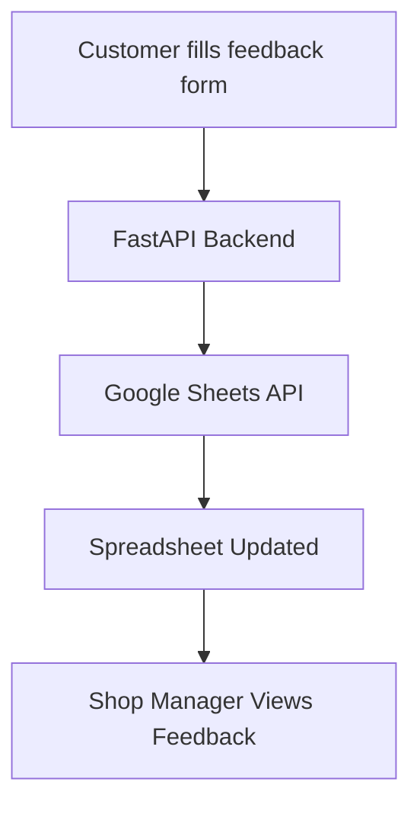

# 🛒 Shopping Feedback System — FastAPI + Google Sheets

> Collect customer feedback directly from your supermarket floor — store it instantly in Google Sheets for easy tracking, insights, and better customer satisfaction.


---

## 🌟 Overview

This project helps supermarkets and retail stores **collect structured customer feedback** right after checkout.
Customers fill in a simple form — and the data is automatically logged in a **Google Spreadsheet** for easy access, analytics, and long-term tracking.

### ✅ Key Features

* **📝 FastAPI REST API** — receive and validate customer feedback
* **☁️ Google Sheets integration** — store all responses in the cloud instantly
* **💻 Simple HTML frontend** — test or deploy in kiosks/tablets in-store
* **📊 Easy access to data** — store owners can open Google Sheets anytime
* **⚙️ Extensible** — ready for dashboards, analytics, and reports

---

## 🧠 How It Works

1. Customers fill out a feedback form after shopping.
2. The backend (FastAPI) receives the data via `/feedback` endpoint.
3. The app automatically appends the feedback into a **Google Sheet**.
4. Shop managers can view or analyze all records directly in Google Sheets.



---

## 🧩 Tech Stack

| Layer              | Technology                        |
| ------------------ | --------------------------------- |
| Backend            | **FastAPI (Python)**              |
| Database           | **Google Sheets API**             |
| Validation         | **Pydantic**                      |
| Environment Config | **python-dotenv**                 |
| Frontend           | **HTML + Fetch API (index.html)** |
| Deployment         | Render / Railway / Vercel         |

---

## 🧾 Feedback Data Model

| Field                     | Type          | Description                      |
| ------------------------- | ------------- | -------------------------------- |
| `name`                    | string        | Customer name                    |
| `contact`                 | string        | Phone number or email            |
| `shopping_rating`         | integer (1–5) | Customer satisfaction rating     |
| `items_not_found`         | string        | Items the customer couldn’t find |
| `price_reduction_items`   | string        | Items they’d like to see cheaper |
| `improvement_suggestions` | string        | General improvement feedback     |

---

## ⚙️ Project Structure

```
shopping_feedback/
│
├── main.py                 # FastAPI entry point
├── models.py               # Pydantic data schema
├── services/
│   └── google_sheets.py    # Google Sheets integration logic
├── index.html              # Test frontend form
├── requirements.txt        # Python dependencies
├── .env.example            # Environment variables template
└── README.md               # Project documentation
```

---

## 🚀 Setup Guide

### 1️⃣ Clone the repository

```bash
git clone https://github.com/yourusername/shopping-feedback-fastapi.git
cd shopping-feedback-fastapi
```

### 2️⃣ Set up Google Sheets API

1. Go to [Google Cloud Console](https://console.cloud.google.com/)
2. Create a **new project**
3. Enable **Google Sheets API**
4. Create a **Service Account**, download `credentials.json`
5. Share your target Google Sheet with the service account email (Editor access)
6. Copy your Spreadsheet ID (from the Sheet URL)

---

### 3️⃣ Configure Environment

Create a `.env` file using the example below:

```
GOOGLE_CREDENTIALS_PATH=credentials.json
SPREADSHEET_ID=your_spreadsheet_id_here
SPREADSHEET_RANGE=Sheet1!A:G
UVICORN_HOST=127.0.0.1
UVICORN_PORT=8000
```

---

### 4️⃣ Install Dependencies

```bash
python -m venv venv
source venv/bin/activate   # macOS/Linux
venv\Scripts\activate      # Windows

pip install -r requirements.txt
```

---

### 5️⃣ Run the App

```bash
uvicorn main:app --reload
```

The API will be available at:
👉 [http://127.0.0.1:8000](http://127.0.0.1:8000)

---

## 🧪 Testing the App

### Option 1: Postman

POST to `/feedback` with JSON body:

```json
{
  "name": "Jane Doe",
  "contact": "jane@example.com",
  "shopping_rating": 5,
  "items_not_found": "Cereal, Milk",
  "price_reduction_items": "Butter",
  "improvement_suggestions": "Add more checkout counters"
}
```

### Option 2: HTML Form

Open `index.html` in your browser and fill the form.
You’ll see a “Feedback submitted successfully 🎉” message when it works.

---

## 🧰 Example Google Sheet Layout

| Timestamp            | Name     | Contact     | Rating | Items Not Found | Price Reduction Items | Suggestions             |
| -------------------- | -------- | ----------- | ------ | --------------- | --------------------- | ----------------------- |
| 2025-11-12T13:02:00Z | John Doe | 08012345678 | 5      | Milk            | Rice                  | "Everything was great!" |

---

## 🧱 Future Improvements

* 📈 Add analytics dashboard (e.g., average rating per week)
* 📬 Send thank-you emails after submission
* 🔐 Admin authentication & access control
* 🗃️ Export feedback as CSV / Excel
* 💡 Sentiment analysis of customer comments

---

## 📸 Screenshots

| Customer Feedback Form                                                                   | Google Sheet View                                                               |
| ---------------------------------------------------------------------------------------- | ------------------------------------------------------------------------------- |
|  |  |

---

## 💼 Why This Project Matters

In modern retail, understanding customer experience in real time is key to loyalty and retention.
This project provides an easy, cost-effective solution to collect, store, and analyze customer satisfaction data — **without building a full database backend.**

> 🧠 Designed for scalability, transparency, and actionable insight.

---

## 🧑‍💻 Author

**👤 Engr Ipaye**
📧 [(mailto:b.tunde.ipaye@gmail.com)]
💼 [LinkedIn Profile](https://linkedin.com/in/engripayebabatunde)
🐙 [GitHub](https://github.com/engripaye)

---

## 🪪 License

This project is licensed under the [MIT License](LICENSE).

---
